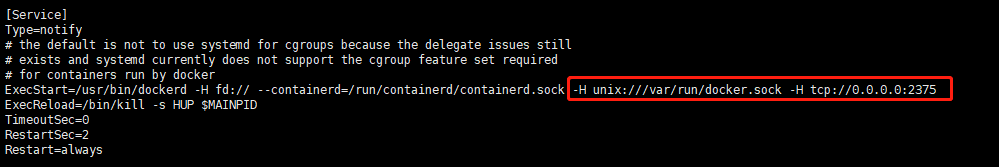

# IDEA中配置及使用Docker

## 启用Docker支持

IDEA 连接CentOS7虚拟机中的Docker，需要修改Docker配置文件，让其开放Docker Remote API

1. 查看配置文件位置：

```shell
systemctl show --property=FragmentPath docker
```

2.编辑该文件

```shell
vi /usr/lib/systemd/system/docker.service
```



这是要添加的内容

```shell
-H unix:///var/run/docker.sock -H tcp://0.0.0.02375
```

3.重新加载配置文件，重启docker

```shell
systemctl daemon-reload
systemctl restart docker
```
