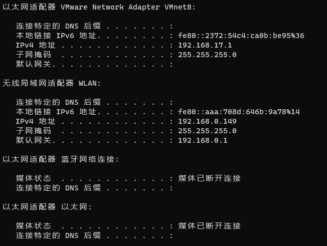
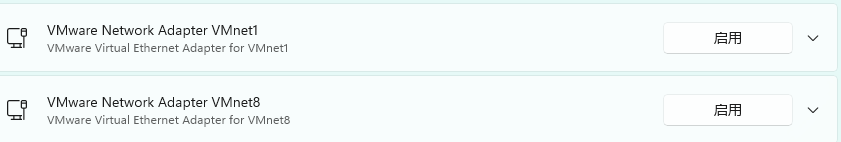

# 解决Springboot配置Springboot admin IP地址显示正确

## 虚拟网卡是问题所在

SpringBoot项目服务启动后，Springboot admin上注册的服务ip地址与本机ip地址不相同，导致服务无法访问原因：SpringBoot项目注册到注册中心时，会随机访问选取一块网卡的ip地址进行注册。由于本机上存在v8虚拟网卡，导致注册的服务ip是v8虚拟网卡的ip。

spring boot admin 显示的注册服务地址显示的是192.168.17.xx。下图

## 解决方案

禁用虚拟机网卡就行了

