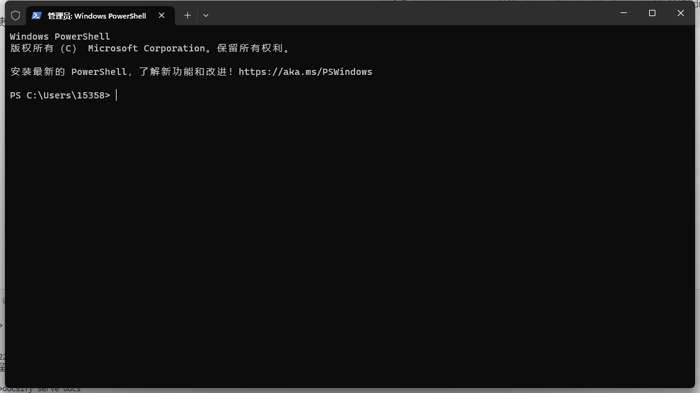
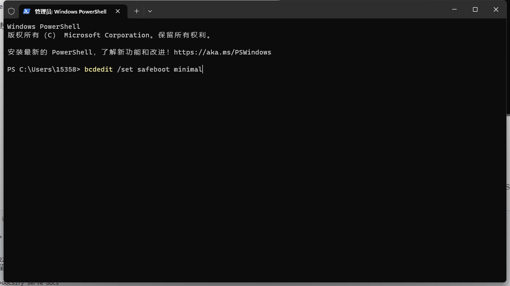
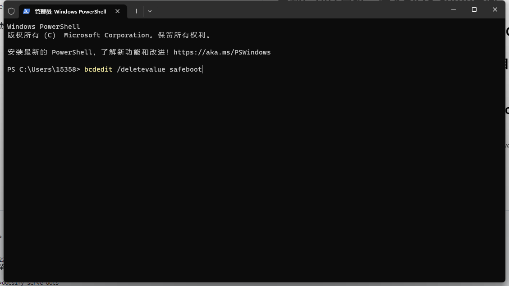

## 以管理员身份打开cmd，不是那个普通的cmd哈。

## 输入`bcdedit /set safeboot minimal`回车

## 重新启动计算机，进入BIOS Setup界面
## 将SATA操作模式从IDE或RAID更改为AHCI
## 保存更改并退出安装程序，Windows将自动启动到安全模式
## 以管理员身份打开cmd，不是那个普通的cmd哈。
## `.bcdedit /deletevalue safeboot`回车

## 重新启动一次，Windows将自动启动AHCI驱动程序。
## 可以装Ubuntu了。